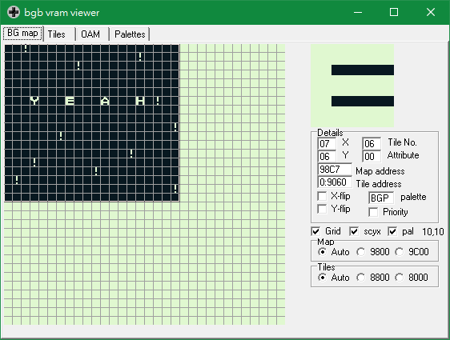
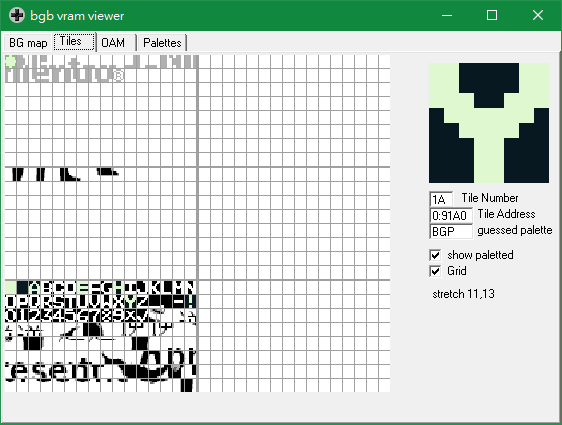
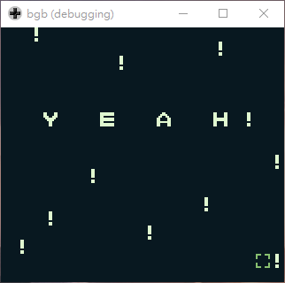

# Computer Security 2019 Final CTF 
## 隊名與組員
> NTUQQ
- 電機三趙崇皓 Mckinsey666
- 電機三李子筠 null
- 電機三陳昱行 jchen8tw
- 資工三李豈翔 katoreA

## 解題統計
|Category|Solves|
|---|---|
|pwn|1|
|reverse|3|
|web|1|
|crypto|0|
|misc|2|
|Total|7|
## 分工
每一題都有列出負責人（主要討論的隊員）。大概的分工是：Mckinsey666, null 各主題都有幫忙看，katoreA 是 reverse, crypto 和 misc，jchen8tw 是 web 和 misc。

## 解題流程
### [Reverse] PokemonGo
> 負責人：null, Mckinsey666

這題只拿到一個程式執行的 trace log，分析一下以後發現是 golang 的（知道這個其實沒用）。整個 trace 很長，但其實有很多是 library function 或各種 system function 不重要，把這些東西忽略以後，先去搜索整個 trace 裡面 `Pokemon` 一開始出現在：
```
Entering main.main at /home/terrynini38514/Desktop/PokemonV2.go:38:6.
.0:
	 t0 = new string (input)
```
看起來 t0 是一個輸入。接著進入 golang 的
 scanf 函式（不重要），然後回到 `Pokemon`：
 ```
 Leaving fmt.Scanf, resuming main.main at /home/terrynini38514/Desktop/PokemonV2.go:40:14.
	 t6 = *t0
	 t7 = PikaCheck(t6)
Entering main.PikaCheck at /home/terrynini38514/Desktop/PokemonV2.go:6:6.
```
這邊很就很明顯了，PikaCheck 應該是去檢查我們的輸入是否符合條件（也就是 flag）。PikaCheck 一開始初始化一個陣列：
```
.0:
	 t0 = local [20]int (a)
	 jump 3
```
接著就是迴圈判斷（for loop)：
```
.3:
	 t92 = phi [0: 0:int, 1: t10] #i
	 t93 = len(input)
	 t94 = t92 < t93
	 if t94 goto 1 else 2
```
迴圈本體是：
```
.1:
	 t1 = &t0[t92]
	 t2 = input[t92]
	 t3 = convert int <- uint8 (t2)
	 t4 = t92 + 1:int
	 t5 = len(input)
	 t6 = t4 % t5
	 t7 = input[t6]
	 t8 = convert int <- uint8 (t7)
	 t9 = t3 + t8
	 *t1 = t9
	 t10 = t92 + 1:int
	 jump 3
```
這邊很明顯是把輸入的第 i 和 第 i+1 個字元加起來存入 t0[i]。
   
這個迴圈執行完以後，就會進入下一步的檢查（下面是一組，總共有 20 組）：
```
t11 = &t0[0:int]
t12 = *t11
t13 = t12 - 185:int
t14 = 0:int + t13
...
```
這邊就是檢查 t0 裡面的每一個值。

### [pwn] Impossible
> 負責人：Mckinsey666

這題基本上是要 bypass 長度的限制。注意到當長度輸入是負的，程式是用 `len = abs(len)` 的方式來修正。這邊很自然會想到利用 int 的邊界條件。
   
```c
len = -2,147,483,648;
...
len = abs(len); // len is still -2,147,483,648 due to overflow
...
read( 0 , buf , len ); // len interpreted as size_t 
```
如上所示，如果我們將 `len` 設為 int 最小值，就可以繞過長度大小檢查，再利用 read 會 implicit cast 的特性，就可以達到 bof。
   
知道可以 bof 以後，接下來就簡單了。因為這題 PIE 沒有開，所以可以輕易訪問 .plt 和 .got。這邊串個 ROP chain 先讀 puts@got 拿到 puts 的 libc，然後算出 libc base。接著回到 main。第一次 ROP 如下：
```
pop_rdi, ret
puts@got address
puts@plt
main // 跳回 plt 再 ROP 一次
```
現在拿到了 libc base，就可以輕易拿到 system address，所以這邊就再 rop 一次：
```
ret // alignment 的問題
pop_rdi, ret
bin_sh libc address 
system libc address
```
執行完就成功拿 shell。

## [web] babyRMI
> 負責人：Mckinsey666

從原始碼看起來 remote 端會有一個 registry，裡面會放一些 RMIInterface 的物件。每個物件有一些函式可以呼叫。執行 compile.sh 就可以執行 runClient.sh，就是去執行 Client.java 的內容。
   
我們發現 Client.java 是呼叫 sayHello()，接下來就嘗試呼叫 getSecret()，他說
```
response: Hint: FLAG is not in this object! Try to find another object :)
```
所以很明顯就是要找其他的 RMIInterface。這邊就將 registry 裡的東西列出來：
```java
String[] boundNames = registry.list();
for (String name : boundNames) {
    System.out.println(name);
}
```
```
FLAG
Hello
```
然後修改一下 Client.java
```java
RMIInterface stub = (RMIInterface) registry.lookup("Hello");
String response = stub.getSecret();
```
就可以拿到 flag。

## [crypto] RSACTR (Unsolved)
> 負責人：katoreA, null, Mckinsey666

這題是結合 RSA 和 block cipher counter mode 的加密，總共只能有三個 query。一開始有幾種想法：
### 想法一
傳 0 可以解出 nonce。傳一個 query 得到 flag 加密的結果，把結果 e 次方（三次方）以後可以列出一個 flag 的三次式 mod(n)。
   
下面都假設在解 flag 的第一個
block（同樣方法可以解另外兩個 block）。假設 flag 的**第一個 block** 是 F<sub>1</sub>。然後包含 nonce 的 counter 值是 C（這是可控的）。
- 我們拿到的密文是 (F<sub>1</sub> + C<sup>d</sup>) mod(n) = M<sub>1</sub>（往後省略 mod(n))。
-  三次方以後得到 (F<sub>1</sub> + C<sup>d</sup>)<sup>3</sup>
- 展開得 F<sub>1</sub><sup>3</sup> + F<sub>1</sub><sup>2</sup>C<sup>d</sup> +F<sub>1</sub>C<sup>2d</sup> + C<sup>3d</sup>
- 注意 C<sup>3d</sup>modn = C （由RSA定義）以及 C<sup>d</sup> = （M<sub>1</sub> - F<sub>1</sub>）modn。
- 化簡得 F<sub>1</sub><sup>3</sup> + F<sub>1</sub>C<sup>d</sup>(F<sub>1</sub>+C<sup>d</sup>) + C = F<sub>1</sub><sup>3</sup> + F<sub>1</sub>M<sub>1</sub>(M<sub>1</sub> - F<sub>1</sub>) + C = M<sub>1</sub><sup>3</sup>

由於 M<sub>1</sub>, C 都是已知，現在就是要解一個模n下的三次式。
### 想法二
> 稍微修改一下想法一

想法一只用到了兩次的 query，但題目給了三次，其實可以多用一次。所以最後一次 query 就再送一次 flag query，這時的 counter 變成上一個 query 的 counter + 6060 = C'。假設這次第一個 block 的密文是M<sub>2</sub>。
   
利用想法一的結果，可以列出
- F<sub>1</sub><sup>3</sup> + F<sub>1</sub>M<sub>1</sub>(M<sub>1</sub> - F<sub>1</sub>) + C
- F<sub>1</sub><sup>3</sup> + F<sub>1</sub>M<sub>2</sub>(M<sub>2</sub> - F<sub>1</sub>) + C'
- 相減得到 F<sub>1</sub>(M<sub>2</sub><sup>2</sup>-M<sub>1</sub><sup>2</sup>)+F<sub>1</sub><sup>2</sup>(M<sub>1</sub>-M<sub>2</sub>) + 6060 = M<sub>2</sub><sup>3</sup>-M<sub>1</sub><sup>3</sup>

這邊變成要解一個模n下的二次式。
   
因為要在模n下解，我就假設每個多項式除以n的商然後用sagemath去解爆搜，但都沒有做出合理的結果。

## [web] King of PHP (Unsolved)
> 負責人：jchen8tw, Mckinsey666

一開始看到原始碼大概知道可以用`c`來寫入檔案，並且可以透過傳`array`bypass strlen的檢查。用`f`可以任意讀檔，但flag不在根目錄下的/flag，因此覺得flag應該是執行擋，所以應該是要rce。

之後有查到 file_get_contents + phar 可以 rce，但是需要`__destruct` 或 `__wakeup` 等magic method 才能製造POP


https://blog.zsxsoft.com/post/38
https://ithelp.ithome.com.tw/articles/10204416
```php
strtolower($filename[0]) == "p" ? die("Bad 🍊!") : die(htmlspecialchars(file_get_contents($filename))); 
```
會檢查第一個字是不是p，所以`php://` `phar://`不能直接用，要用`compress.bzip2://`來bypass。

後來又找到他的php_info，用下面的工具

https://github.com/GoSecure/php7-opcache-override

算出他的system_id

```
PHP version : 7.4.3-dev
Zend Extension ID : API320190902,NTS
Zend Bin ID : BIN_48888
Assuming x86_64 architecture
------------
System ID : 418f4c6e5989490277b52c8b4023b08e
```


後來看到

https://eductf.zoolab.org:28443/?f=/usr/local/etc/php/conf.d/php-king.ini

裡面會用preload.php 去 preload opcache，可是php.ini裡面`opcache.file_cache`又是空白的，直接去訪問php opcache的預設路徑也真的找不到東西。

https://eductf.zoolab.org:28443/?f=tmp/opcache/418f4c6e5989490277b52c8b4023b08e/var/www/index.php.bin

原本想要利用`preload.php`裡的__detruct去串POP，因為裡面有

```php 
exec('rm' .$this->path)
```
只要能控path就能rce了，可是$path是private variable 沒辦法透過繼承去更動他，最後就卡在這裡....

## [misc] Ponzi Scheme
> 負責人：katoreA

進去之後要解 PoW，解了之後進入起始金額 1000 的賭博網站，要把錢賭到 10000。
每次只能把錢 all in 進獎金池裡，在一定時間後會得到某個倍數的獎金量。
如果拿獎金時池裡沒有足夠的錢，就會破產。
做法：
- 註冊一些帳號，投資最大的（可以在 1hr 後得到10000）。
- 註冊更多一些帳號備用。
- 在接近一個小時的期限時，把全部的備用帳號裡的 1000 元都丟進獎金池裡。
- 原本那些帳號獲得 10000，得到 FLAG。


## [reverse] H0W
> 負責人：null, katoreA

題目主要是給一個 pyc，以及一個 terrynini.so。

把 pyc decompile 之後可以看到主要是讀進來一個檔案，然後用 terrynini 裡面的一堆 function 來處理資料。

terrynini 是用 C 寫得 python extension，在 PyInit_terrynini 裡面可以看到使用到了 `PyModule_Create2`，而 `PyModule_Def` 在 0x2020a0。

接下來就直接打開 gdb attach python process，看 terrynini.so + 0x2020a0 的內容，可以找到他的 m_methods，在裡面可以找到 nini1 ~ nini6 的 address。

有了 address 之後就可以知道原本在 terrynini.so 裡面的 offset，也可以設 breakpoint 去 debug。

最後解出來的每個 function 如下：

- nini1：把 `time(0)` 存在 GitHub

- nini2：把 GitHub 的值用 gmtime 和 sprintf 輸出成字串，格式是 年月星期時分秒

- nini3：把 `fopen("output.txt", "w")` 得到的 pointer 存在 JetBrains

- nini4：把 GitHub 當成 seed，`srand(GitHub)`

- nini5：傳入一個數字，用 `rand()` 的值來選 otakunokokyu 中的 function 來處理（分別有 ichi, ni, san, yonnokata 四個 function）

- nini6：把傳入的東西寫到 JetBrains 所指的檔案裡面，每次寫四個 byte

而 ichinokata 是在 xor 0xfaceb00c，ninokata 是加上 0x12384，sannokata則是偶數 bit 向右轉 4個 bit，奇數 bit 向左轉 2 個 bit。yonnokata 則是 `x => sannokata(ninokata(ichinokata(x)))`

H0W.py 會引用一個 binary 檔，然後使用時間亂數，對原檔案裡的內容每四個bytes隨機施展某個型。
有四種型，每一種都是一個可反的，4bytes->4bytes 的函數，一開始給了一個預設的很長的 output。
並且隨機用的時間被記在檔案的最後面。
思路就是把時間強制挪回那個時間戳記的位置，去看他會對每一個 block 做出什麼操作，然後在對每個操作做出相反的操作。
作法：
- 寫一個 timeStopper，把時間挪回並停在 2019-9-11 13:25:14
- 用 nini5(0) 去觀察每一個 block 會使用哪一種型。
- 寫出「反型」，對 output 的東西做一次。
- 得到一張 .png，打開 .png 得到 FLAG。

## [reverse] YugiMoto
> 負責人：null, katoreA

用 file 去看 `main.gb`，發現是 Game Boy ROM image。

在 windows 上找了 BGB 這個 emulator，跑起來發現要輸入一串字，錯誤的話會跳到 no no no的畫面。

BGB 有 debug mode 可以用，其中可以看到目前的 map 在記憶體中的位址



在按下確認之後讓 debugger 停住，可以找到檢查輸入的 function 應該是在 0xe61

在 0xe61 最後可以看到這樣的 code
```asm
ld   hl, 0xC798
ld   a, (hl)
cp   a, 0x14      ; while i < 0x14 (0~19: 20 個 byte)
jp   nc, 0x0FAE   ; {
ld   c, (hl)
ld   hl, sp+00
ld   e, (hl)
inc  hl
ld   d, (hl)
ld   l, c 
ld   h, 0x00
add  hl, de
ld   e, l
ld   d, h
ld   a, (de)
ld   c, a         ;   c 0xDFD8[i]
ld   hl, 0xC798
ld   b, (hl)
ld   a, 0x9A
add  b
ld   e, a
ld   a, 0xC7
adc  a, 0x00
ld   d, a
ld   a, (de)      ;   a = 0xC79A[i]
cp   c            ;   compare c with a
jr   nz, 0x0FA2
jp   0x0FA7
ld   e, 0x00
jp   0x0FB0
ld   hl, 0xC798
inc  (hl)         ;   i += 1
jp   0x0F77       ; }
ld   e, 01
add  sp, 16
pop  bc
ret
```

主要是在比較 0xDFD8 和 0xC79A 的值有沒有一樣，而 0xe61 前面的 code 就是在設定 0xDFD8(在 stack 上) 的值。

看前面的 code 可以知道他的值不會被 input 影響，可以得到如下的陣列：

```
[0x10, 0x09, 0x0e, 0x1a, 0x08, 0x10, 0x05, 0x1a, 0x20, 0x16, 0x02, 0x13, 0x06, 0x08, 0x02, 0x0e, 0x23, 0x03, 0x20, 0x1a]
```

利用 BGB 的 vram viewer 對應到每個 tile 的 tile number。如下圖，Y 對應到 0x1A



轉換之後就可以得到 `OHMYGODY0UAREGAM3B0Y`，也就是 FLAG

輸入之後會出現 yeah 的畫面



## [reverse] VwVwVw (Unsolved)
> 負責人：null

一開始會拿到一個 binary，執行之後會看到他的使用方式是 `./verify flag`，把 flag 放在第一個參數。

如果 flag 長度不對，會輸出 `wrong`，而看 disassembly，正確的長度是 24。

同樣是看 assembly，可以看到輸入正確的 flag 會印出 `You got it FLAG{%s}!`

接著就是看 assembly 的部份

```
s = argv[1]

for(i = 0; i < strlen(s); ++i) {
  s[i] ^= argv[0][i % strlen(argv[0])];
}

s1 = (char*)malloc(0x20);

xmm0 <- argv[1] 之後 16 個 char
xmm0 <- argv[1]+0xc 之後 16 個 char

cs = {0xa, 0xb, 9, 0xa, 7, 8, 6, 7, 4, 5, 3, 4, 1, 2, 0, 1, 0xa, 0xb, 9, 0xa, 7, 8, 6, 7, 4, 5, 3, 4, 1, 2, 0, 1}

// 一堆 vector instruction

for(i = 0; i < strlen(s1); ++i) {
  s1[i] ^= argv[0][i % strlen(argv[0])];
}

memcmp(s1, 0x402458, 0x20);

for(i = 0; i < strlen(s); ++i) {
  s[i] ^= argv[0][i % strlen(argv[0])];
}
print("You got it FLAG{%s}\n", s);
```

可以看到大概是先把輸入做 xor argv[0]，在做一些 transform，最後再 xor 回來，然後檢查和 0x402458 是不是一樣。

不過因為我不太熟 avx，所以中間 vector instruction 看很久，在比賽結束之前來不及看完。

### [web] how2meow (Unsolved)
> 負責人：null, jchen8tw

這題大致上看起來跟 how2xss 有點像，都是要想辦法用 xss 拿到 cookie，再傳網址過去。

不過有給上傳檔案的功能，能夠上傳的是 zip 檔，副檔名要是 .meow。裡面要有一個 meow 檔，內容是 edu-ctf 開頭。

直接在 meow.php 打 html 可以直接注入。但是因為有設 content security policy，所以寫在 handler 或是 script tag 裡面的東西不會被執行。

因為 content-security-policy 是 `default-src ‘self’ ‘unsafe-eval’; img-src *;`，所以我嘗試用 script tag 引入上傳的 zip，在 zip 最後加 js code，不過還是會因為 syntax error 提前中止。

同樣的，用 img 和 svg 也會發生一樣的問題。

接著因為沒有方向就沒有繼續下去。

## [web] echo (Unsolved)
> 負責人：Mckinsey666, jchen8tw

進入頁面可以看到一個輸入的地方，當按下 echo 以後網頁就會顯示我們輸入的東西。
   
去查看網頁原始碼可以發現註解掉了 echo.zip，直接去訪問 echo.zip 可以拿到原始碼。我們發現網頁是使用 ejs 這個 web template 語法：
```
<%=text %>
```
把輸入的參數 text 取代到這個 ejs tag 裡面。因為跟 template injection 不是很熟，所以就去查了一下 ejs 有沒有相關的 template injection，但都查不太到，只有查到一個跟 Lodash 有關的 prototype pollution 的洞，但這題也沒有用到 Lodash。
   
因為不知道怎麼辦只好去 trace ejs 的原始碼，知道他會呼叫一個 render() 函式把模板和參數傳入，再深入往源追溯發現實際執行的函式是 exports.compile -> Template().compile。
   
Template 這個物件會去 parse template file，並且把輸入參數當成 data render 出來。我雖然只有 trace 到這邊，不過猜測應該是 parse 的地方有一些漏洞。