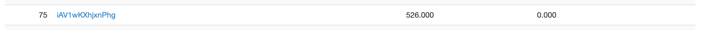

# watevr CTF 2019
## 隊名及組員
iAV1wKXhjxnPhg
- 李子筠
- 趙崇皓
- 陳昱行

## Scoreboard
總共 692 隊參加，最後我們的排名是 75，最高排名是 38。

## 分工
我主要看 misc, web, forensics 和一點reverse，子筠研究 crypto 和 pwn 和一點 web，昱行看 web 和 reverse。我們找了一天學校家裡連線解題討論。

## 參與題目
| Problem               | Category  | Solved |
| --------------------- | --------- | ------ |
| Voting Machine        | pwn       | no     |
| Pickle Store          | web       | yes    |
| Swedish State Service | web       | yes    |
| Super Sandbox         | web       | no     |
| Evil Cuteness         | forensics | yes    |
| Blurry Image          | forensics | no     |
| Sanity Check          | misc      | yes    |
| Unspaelleble          | misc      | yes    |
| Polly                 | misc      | no     |
| Fuckn't               | rev       | yes    |

## Writeup
### Pwn - Voting Machine
> 題目說明：給一個執行檔。

基本上就就只是最簡單的 bof，執行檔裡面用了 get，還有讀 flag 的 function。直接覆蓋 return address 就可以拿到 flag 了。

### Crypto - ECC-RSA
> 題目說明：給一個用來加密 flag 的 py 檔，以及加密時的參數。

加密過程基本上就是用橢圓曲線乘法找到 x, y 都是質數的點，然後再拿來當 RSA 的質數。

橢圓曲線的參數已知質數, a, b, 以及點 G，RSA 則是已知 e 和 p*q。

一開始花了一些時間去查橢圓曲線的作法，最後根據橢圓曲線的式子和 RSA 的定義可以寫出兩個式子：

$$
y^2 = x^3 + ax + b \pmod{p}\\
x \cdot y = N\\
$$

其中 x, y 解出來就是 RSA 的 key p, q。理論上變數只有兩個，有兩個式子應該解得出來，但是因為我數學不好所以用了各種方法都解不出來，只有把他化成如下的多項式(剩下 x 一個未知數)。

$$
N^2 = x^5 + ax^3 + bx^2 \pmod{p}
$$

到這邊我就不知道如何解了，最後去看官方解法，發現這種問題其實已經有演算法可以解，甚至直接用 sage 就可以 factor 找出因式。

雖然整個題目沒有很難，但是主要是我不知道如何解 mod p 下的多項式，這題讓我知道這種問題的確切名字，之後可以來研究看看。

### Web - Cookie Store
> 題目說明：網頁會顯示你現在有 500 元，買到 1000 元的 cookie 就可以拿到 flag。

把cookie裡的值base64decode之後，會拿到一個json，裡面包含自己錢的資訊，直接改再base64回去，就可以買到flag了

### Web - Pickle Store
> 題目說明：網頁會顯示你現在有 500 元，買到 1000 元的 pickle 就可以拿到 flag。

其實這次 ctf 還另外有一題 cookie store，然後就是改他的 cookie 就可以直接把自己的錢改很大去買 cookie 拿到 flag。這題叫做 pickle store，很明顯就是跟 pickle 有關。

一樣先去看瀏覽器裡面存的值，不過這時候只把 cookie base64 decode 也不會產生有意義的東西。這時把 decode 出來的東西 pickle.loads，就可以回復出一個 json 物件。

和 cookie store 不同的是，json 裡面多了一個 anti_tamper_hmac 的 field，去查了發現是個防止使用者隨便改值而隨機產生的 id。所以這題的解法沒有 cookie store 那麼水。

但其實他既然會用到 pickle，那就可以用 deserialization，所以我們就產生一個 reverse shell payload 然後 pickle.dumps，再塞回去瀏覽器的 cookie，很輕易的就拿到 reverse shell。

### Web - Swedish State Service
> 題目說明：給一個靜態網頁。

很自然的先去看看網頁的原始碼，發現他在 meta tag 裡面有一個路徑是 server.py，所以就直接去訪問那個路徑，沒想到就直接拿到了原始碼。

裡面用白名單檔 .gti 這個字串，所以明顯就是要我們去拿 .git。這時用 url 路徑去訪問 .git 裡面的資料也可以順利拿到，所以只要把
遠端的 .git 下載下來就可以試圖回覆之前的歷史。

我用 Scrabble (https://github.com/denny0223/scrabble) 幫我回復資料夾的內容後回到了把 flag.txt 移除的 commit，雙利拿到 flag。

### Web - Super Sandbox
> 題目說明：要求做到 alert(1) 後就可以拿到 flag。

去看了網站的原始碼發現裡面有個很像 jsfuck 的東西，基本上就是有個 `env` object，一開始裡面有四個 primitive，分別是 `(x, y) => x[y]`, `(x, y) => x+y`, `(x) => !(x)`, `[]`。

可以傳入一個字串，讓那個 sandbox 去執行，他會以四個字元為單位，傳入 destination, function, arg1, arg2，四個東西都是 `env` 的 key。他會從 `env` 中取出值，將兩個 arg 丟給 function，再存到 env 中的 destination。

雖然 env 中我們能寫入的 key 是以字元為單位。不過 js 字串是 unicode，所以也可以用中文當 key，就不太需要擔心 key 不夠用(同時還能增加一點可讀性)。

雖然和 [jsfuck](https://github.com/aemkei/jsfuck/blob/master/jsfuck.js) 不太一樣，但是還是可以參考 jsfuck 的做法，很容易可以做出 true, false, undefined。\

不過有一些東西就需要自己發揮創意，例如這個 `env` 裡面沒有 unary plus，不能像 jsfuck 裡面用 `+[![]]` 做出 NaN，不過因為有 binary plus，可以用 `undefined + undefined` 做出來。

數字方面因為有 binary plus 和 true, false，可以做出所有正數。有了數字之後就可以用 jsfuck 的方法把東西轉成字串，再取其中一個字元，一個字元一個字元把字串拼出來。最後再利用拼出來的字元去爬 prototype chain 或是拿 property。

從 jsfuck 的網站上可以看到這個： `eval => []["filter"]["constructor"]( CODE )()`，可以知道從 `Array.prototype.filter.constructor` 可以拿到 `Function`，而 `Function` 可以用來執行任意 code。

不過由於限制，每次使用 function 都要傳兩個參數，所以我就用 `Function(undefined, "alert(1)")(undefined, undefined)` 來達到 alert(1)。雖然能夠在瀏覽器上成功 alert(1)，但是送過去還是沒有拿到 flag。

最後在 ctf 結束之後看別人的 writeup，發現他是用 `Function([], "alert(1)")([], [])`，推測可能是因為我在 argument list 的地方傳了 undefined 所以才出了問題。雖然最後看不到他們是用什麼環境去執行 js(至少不是 chrome, firefox, nodejs)，不過至少我知道在某些環境下會讓我原本的 payload 失效，還是正常的傳陣列進去會比較好(雖然不用 new 來使用 constructor 本身好像就不太合法)。

### Forensics - Evil Cuteness
> 題目說明：給了一張貓的圖片

丟到 binwalk 去解就可以拿到 flag 了。

### Forensics - Blurry Image
> 題目說明：給了一個很模糊的影像，還有一個原圖的 patch。

明顯就是利用原圖的那個 patch 還有模糊的 patch 來預測 convolution kernel，然後再試圖 deconvolve 回去。

我用 optimization 方法算出 blurring kernel （找到一個 kernel 使得原圖 patch 和 這個 kernel convolution 以後和模糊圖的 MSE 最小）。

拿到了 blurring kernel 以後，就要用這個 kernel 和模糊的圖回覆成原圖。這邊我試圖用 MATLAB, scipy 裡面的一些函式操作都沒有什麼結果。後來我想到可以對輸入的圖做 optimization，使得輸入圖和這個 kernel convolution 以後和模糊圖的 MSE 最小，但因爲時間不夠就沒有寫出來了。

### Misc - Sanity Check
去 Discord 上面翻一翻就找到 flag 了。

### Misc - Unspaelleble
> 題目說明：給了一個 4000 多行的劇本。

讀一讀幾行就會發現有幾個字拼錯。這時候我就去找到原本的 script 然後 diff 一下就拿到 flag 了。

### Misc - Polly
> 題目說明：給了一個係數很大的高次多項式。

觀察一下發現常數項是 119，是 w 的 ascii（比賽flag 型式是 watevr{}）。這時就猜帶入 0, 1, 2,3, 4,.... 就可以拿到 flag，但這邊就ㄧ直錯，卡了一下就先去做別題。

後來沒有解出來，在回顧的時候發現是 Python 數字大小還有浮點數的智障問題。我改用 sympy 就成功了。

### Reverse - Timeout
> 題目說明：題目給了一個會等6秒的執行檔，沒有input

因為題目說明是 Stop wait a minute，可是程式只停6秒，一開始想說是不是用gdb把時間改成1分鐘就會發生神奇的事，結果沒有。

用ghidra reverse出來後，發現有個編譯進去可是沒有跑過的函式，我就在main 的 ret 之前，手動jump到那個函式的位置，就印出flag了。
雖然整題還是意義不明...

### Reverse - Fuckn't
> 題目說明：給了一串 jsfuck

基本上就是照著 jsfuck 的規則把所有 pattern replace 成他產生的東西，就可以看到原本的程式，最後會發現 flag 就是以 ascii 的方式存在裡面。

我解題的時候是一個一個把出現頻率高的東西 replace 掉，不過其實很明顯中間有一大串數字(也經過 jsfuck)，如果先蓋掉數字的話應該就能更快解出來。